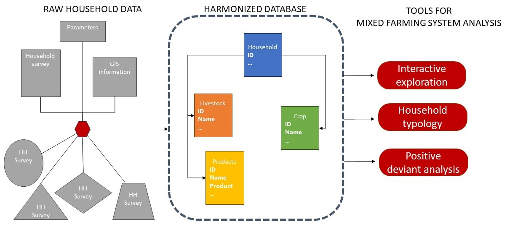

# farmhousehold

Farmhousehold is an R-package that provides tools for mixed farming system analysis. The data platform helps explore farm household survey data with built-in interactive visualization dashboards.

### farmhousehold data format
The data is organized as a four-table relational database recording key information on crop, livestock herd, livestock production, and household food security status. The structure of the database ensures fast computation and maximum compression of the data. It also facilitates the comparison and compilation with other household surveys.  

To know how to transform your household survey data into a `farmhousehold` data object, please look at the [documentation](https://github.com/rfrelat/farmhousehold/raw/main/inst/extdoc/documentation.pdf), the example scripts in [/inst/load_data](https://github.com/rfrelat/farmhousehold/tree/main/inst/load_data), and the [tutorial](https://github.com/rfrelat/farmhousehold/raw/main/inst/extdoc/documentation.pdf)

### Interactive mixed farm system analysis
The farmhousehold package provide interactive plotting functions and dashboards solutions  for:  
1) [exploring your dataset](https://startistic.shinyapps.io/farmhousehold_explo/) : `runExplo()`  
2) [making farm household typology](https://startistic.shinyapps.io/farmhousehold_cluster/) : `runCluster()`  
3) [identifiying positive deviants](https://startistic.shinyapps.io/farmhousehold_posdev/) : `runPosdev()`  

The package comes with a subset of [RHoMIS database](https://www.rhomis.org/), formatted as a `farmhousehold` object. It is available in the package with `data(hhdb_rhomis)` or can be [downloaded here](https://github.com/rfrelat/farmhousehold/raw/main/inst/extdata/mini_rhomis.rds).
 
